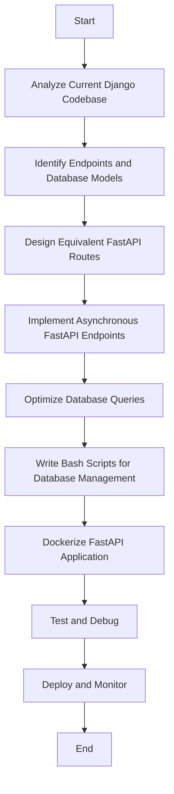

# GSoC Proposal Revision

## **I. About Me**

**Name:** Shashwat Darshan\
**Email:** [shashwatdarshan153@gmail.com](mailto\:shashwatdarshan153@gmail.com)\
**GitHub:** [Shashwat-Darshan](https://github.com/Shashwat-Darshan)\
**Location:** New Delhi, India\
**Timezone:** GMT+5:30\
**Resume:** View Here

I am an enthusiastic software developer with a deep passion for backend technologies, system architecture, and high-performance computing. I have extensive hands-on experience with Python, Django, FastAPI, SQL, and containerization tools such as Docker. My technical foundation is built upon rigorous project-based learning and real-world applications, where I have successfully developed and optimized backend systems. Although my previous projects have been on a smaller scale, I am eager to undertake this significant migration project and work alongside experienced mentors at IHR to develop an efficient, high-performing, and maintainable backend architecture. I see this as an opportunity to further refine my technical capabilities, expand my problem-solving skills, and contribute meaningfully to an open-source initiative that impacts a global audience.

---

## **II. Why I Decided to Work for IHR**

I am thrilled at the prospect of contributing to the Internet Health Report (IHR) project because it presents a combination of complex technical challenges and a mission-driven approach that strongly aligns with my skills and values. The chance to migrate the IHR API from an outdated Django framework to the modern FastAPI, streamline database management using Bash scripts, and deploy the application efficiently through Docker aligns perfectly with my technical expertise in Django, FastAPI, SQL, and containerization technologies.

Beyond the technical aspects, I am deeply passionate about the project’s overarching goal of enhancing internet resiliency and accessibility—two critical components in today’s connected world. By participating in this initiative, I will have the opportunity to collaborate with a diverse and global developer community, gain invaluable hands-on experience in large-scale system migration, and contribute to an essential tool that informs and empowers millions. The combination of technical challenge, real-world impact, and professional growth makes this a compelling and deeply rewarding endeavor for me.

---

## **III. Project Title**

### Migrating IHR Backend from Django 2.2 to FastAPI for Improved Performance, Scalability, and Maintainability

---

## **IV. Abstract**

The current IHR backend is built on Django 2.2.27, an outdated framework that lacks modern asynchronous capabilities. This limitation causes performance bottlenecks under high-concurrency conditions and makes the codebase increasingly difficult to maintain. Additionally, the existing system does not efficiently handle concurrent requests, leading to potential slowdowns during peak usage times.

My proposal is to migrate the IHR backend to FastAPI—a high-performance, asynchronous web framework designed for modern API development. This migration will significantly enhance API response times, simplify the system’s architecture, improve security, and auto-generate comprehensive API documentation using FastAPI’s native OpenAPI support. Furthermore, I will implement Bash scripts for database initialization, management, schema migrations, and seeding, as requested, to improve maintainability and streamline database operations. This transition will ultimately result in a faster, more scalable, and easier-to-maintain backend infrastructure, ensuring that the IHR project remains sustainable and adaptable to future demands.

---

## **V. Key Objectives and Motivation**

### **Key Objectives**

- **API Migration:** Migrate all Django API endpoints to FastAPI using asynchronous processing to reduce latency, increase throughput, and improve scalability. All API endpoints should remain 100% compatible with the existing Django API.
- **Database Management:** Implement Bash scripts for database initialization, schema migrations, management, and seeding, ensuring efficient and maintainable database operations using raw SQL.
- **Containerization & Documentation:** Dockerize the FastAPI application for seamless deployment across different environments and auto-generate comprehensive API documentation using FastAPI’s built-in OpenAPI support.
- **Security:** Maintain existing Django authentication during migration (token-based system → FastAPI JWT parity).

### **Motivation for Migration**

- **Performance Bottlenecks:** The synchronous nature of Django’s views and ORM operations causes slow response times under heavy loads. Asynchronous processing in FastAPI will allow the system to handle a larger number of concurrent requests more efficiently.
- **Maintainability Issues:** The current monolithic codebase is complex and difficult to maintain. Adopting a modular design with type-safe models will simplify the code and improve long-term maintainability. The codebase structure will be proposed to ensure maintainability.
- **Scalability Constraints:** As data volume grows and user demand increases, the existing Django-based architecture struggles to scale. FastAPI’s support for asynchronous requests, combined with optimized database interactions using raw SQL, will significantly enhance the system’s scalability.

---

## **VI. Expected Outcomes**

- **Substantial improvements in API performance** through asynchronous request handling and optimized query execution using raw SQL.
- **A more modular, maintainable, and scalable backend architecture** that is easier to extend and optimize in the future. The codebase structure will be proposed to ensure maintainability.
- **Enhanced developer experience** through automatic API documentation, type safety, and better error handling.
- **Efficient and maintainable database management** through the use of Bash scripts for initialization, migrations, seeding, and operations.
- **Improved system resilience and fault tolerance**, ensuring the IHR API can handle increasing workloads efficiently.

---

# Database Management with Bash Scripts

## 1. Directory Structure

```bash
ihr_fastapi/
├── db_scripts/               # Bash scripts for database operations
│   ├── init_db.sh            # Initializes tables, indexes, and constraints
│   ├── migrate_db.sh         # Applies incremental SQL migrations
│   ├── backup_db.sh          # Creates database backups
│   ├── test_db.sh            # Runs integrity checks
│   └── seed_db.sh            # Seeds initial database data
└── sql/                      # SQL files
    ├── schema/               # Base schema definitions
    │   ├── 01_tables.sql     # Core tables (hegemony, asn, etc.)
    │   └── 02_indexes.sql    # Indexes and constraints
    └── migrations/           # Versioned migration files
        ├── 20240601_add_hegemony_timebin_column.sql
        └── 20240615_alter_asn_table.sql
```plaintext

## 2. Script Implementation

### `init_db.sh`

```bash
#!/bin/bash
# Initialize database schema and seed data
set -e # Exit on error

# Load environment variables
source .env

# Execute schema files in order
psql -v ON_ERROR_STOP=1 \
  -U "$POSTGRES_USER" \
  -d "$POSTGRES_DB" \
  -f /sql/schema/01_tables.sql

psql -v ON_ERROR_STOP=1 \
  -U "$POSTGRES_USER" \
  -d "$POSTGRES_DB" \
  -f /sql/schema/02_indexes.sql

echo "Database schema initialized successfully!"
```plaintext

### `migrate_db.sh`

```bash
#!/bin/bash
# Apply pending migrations
set -e

for migration in $(ls /sql/migrations/*.sql | sort -V); do
  echo "Applying migration: $migration"
  psql -v ON_ERROR_STOP=1 \
    -U "$POSTGRES_USER" \
    -d "$POSTGRES_DB" \
    -f "$migration"
done
```plaintext

### `backup_db.sh`

```bash
#!/bin/bash
# Creates database backups
set -e

timestamp=$(date +%Y%m%d_%H%M%S)
backup_file="backup_${timestamp}.sql"

pg_dump -U "$POSTGRES_USER" -d "$POSTGRES_DB" -f "$backup_file"

echo "Database backed up to $backup_file"
```plaintext

### `seed_db.sh`

```bash
#!/bin/bash
# Seed initial database data
set -e

psql -U "$POSTGRES_USER" -d "$POSTGRES_DB" <<EOF
INSERT INTO hegemony (asn, timebin) VALUES (12345, NOW());
-- Add more seed data as needed
EOF

echo "Database seeded successfully!"
```plaintext

### `test_db.sh`

```bash
#!/bin/bash
# Validate database state
set -e

# Check if hegemony table exists
if ! psql -U "$POSTGRES_USER" -d "$POSTGRES_DB" -c "\d hegemony" &> /dev/null; then
  echo "Error: hegemony table missing!"
  exit 1
fi

echo "Database validation passed."
```

## 3. SQL Schema Example

**File: `sql/schema/01_tables.sql`**

```sql
-- Recreate Django's hegemony table
CREATE TABLE IF NOT EXISTS hegemony (
  id SERIAL PRIMARY KEY,
  asn INTEGER NOT NULL,
  timebin TIMESTAMPTZ NOT NULL,
  originasn INTEGER,
  weight FLOAT
);

-- Recreate indexes
CREATE INDEX IF NOT EXISTS hegemony_timebin_idx ON hegemony(timebin);
```

## 4. Workflow Integration

### **Docker Integration**

**Dockerfile:**

```dockerfile
FROM python:3.11

# Copy scripts and SQL files
COPY db_scripts/ /db_scripts/
COPY sql/ /sql/

# Set permissions
RUN chmod +x /db_scripts/*.sh

# Run initialization during container startup
CMD ["/db_scripts/init_db.sh && uvicorn app.main:app"]
```

#### **SQL Transaction Rollbacks**

```sql
-- sql/migrations/20240601_example.sql
BEGIN;
ALTER TABLE hegemony ADD COLUMN new_column INT;
-- On error: ROLLBACK;
COMMIT;
```

## 5. Error Handling

- **Bash Scripts:** Use `set -e` to exit on errors and `-v ON_ERROR_STOP=1` in `psql`.
- **SQL Files:** Wrap changes in transactions (`BEGIN;`/`COMMIT;`).
- **Logging:** Redirect script output to logs (e.g., `init_db.sh 2> logs/db_errors.log`).

---

## **Flowchart of Migration Process**



---

## **VII. Deliverables and Timeline**

## **Project Deliverables**

### **Core Migration:**

- Migrate all essential Django views and API endpoints to FastAPI with asynchronous support, ensuring 100% API endpoint compatibility.
- Implement structured request handling and response validation using Pydantic models.
- Manage database schema changes and versioning primarily using version-controlled SQL files and Bash scripts.
- Maintain existing Django authentication during migration (token-based system → FastAPI JWT parity).

### **Key Enhancements:**

- Strengthen input validation and enforce security best practices.
- Introduce caching mechanisms such as Redis to optimize frequently accessed database queries.
- Conduct load testing to identify and address performance bottlenecks.
- Containerize the FastAPI application using Docker for efficient deployment.
- Maintain comprehensive project documentation, including migration guides and API documentation.
- Implement extensive test coverage using `pytest` and `pytest-asyncio` for robustness.
- Auto-generate API documentation with FastAPI’s OpenAPI support for developer ease-of-use.

### **Potential Stretch Goals (Mentor Approval Required):**

- [ ] Redis caching implementation
- [ ] CI/CD pipeline setup
- [ ] Advanced authentication (OAuth2)

## **Timeline and Implementation Plan**

### **Community Bonding (May 8 - June 1, 2025)**

#### **Goals:**

- Develop a thorough understanding of the existing Django 2.2 codebase, including its models, API endpoints, and database structure.
- Engage closely with mentors to discuss detailed migration strategies, clarify any ambiguities, and align on the preferred approach for database interactions (primarily Bash scripts and raw SQL).
- Document the current API behavior, dependencies, and identify key challenges, notably understanding the existing codebase.
- Set up the initial development environment and explore the FastAPI framework in the context of the existing IHR application.
- Define key milestones and deliverables with mentor input.

#### **Tasks:**

- Study and analyze existing models (`models.py`), including `Hegemony`, `ASN`, `Country`, and database caching strategies.
- Review API endpoints in `views.py` such as network monitoring and hegemony analysis.
- Document authentication methods, database relationships, and performance bottlenecks.
- Prepare a high-level migration roadmap with mentors.

#### **Challenges:**

- Understanding the complex business logic in the existing Django codebase.
- Identifying potential pitfalls in migrating monolithic components.

---

## **Migration Strategy**

A complete switch to FastAPI is the preferred migration strategy.

### **Component-wise Migration**

#### **Database Layer (Primarily Bash-based approach)**

##### **Schema Initialization**

```bash
#!/bin/bash
export PGPASSWORD=$POSTGRES_PASSWORD
psql -U "$POSTGRES_USER" -d "$POSTGRES_DB" -f /sql/init.sql
```

##### **Migrations**

```bash
#!/bin/bash
psql -U $POSTGRES_USER -d $POSTGRES_DB -f /migrations/001_create_hegemony_table.sql
```

##### **Data Seeding**

```bash
#!/bin/bash
psql -U "$POSTGRES_USER" -d "$POSTGRES_DB" <<EOF
INSERT INTO hegemony (asn, timebin) VALUES (12345, NOW());
-- Add more seed data as needed
EOF
```

#### **API Endpoints**

```python
from fastapi import APIRouter, Depends
from typing import List

router = APIRouter()

@router.get("/hegemony/", response_model=List[dict])
async def get_hegemony(timebin: str = None):
    # Migrate existing Django view logic to async
    # Add caching and optimized database queries using raw SQL
```

### **3. Migration Phases**

```markdown
Phase 1: Core Setup (June 2 - June 15, 2025)
- Set up the FastAPI project structure
- Establish core middleware and basic request handling
- Configure database connection setup, focusing on PostgreSQL
- Implement the initial basic API endpoints to establish a functional foundation
- Set up Docker containers for FastAPI and PostgreSQL
```

### **4. Key Components to Migrate**

```markdown
1. Database Management:
   - Schema initialization (`init_db.sh`)
   - Migrations (`migrate_db.sh`)
   - Backup and restoration (`backup_db.sh`, `restore_db.sh`)
   - Database seeding (`seed_db.sh`)

2. API Endpoints:
   - `/hegemony/`
   - `/hegemony/countries/`
   - `/hegemony/asns/`
   - User management endpoints

3. Authentication:
   - Token-based auth → JWT
   - User sessions
   - Permissions
```

### **5. Technical Considerations**

```python
# Requirements
fastapi>=0.100.0
pydantic>=2.0.0
python-jose[cryptography]
passlib[bcrypt]
redis>=4.5.0
asyncpg>=0.29.0 # For asynchronous PostgreSQL interactions
```

### Phase 1: Core Setup (June 2 - June 15, 2025)

#### Goals for Phase 1

- Establish the fundamental structure of the FastAPI project.
- Implement core middleware for request handling and error management.
- Configure database connectivity to PostgreSQL.
- Migrate a few initial API endpoints to ensure a working base.
- Set up basic Docker containers for the FastAPI application and the PostgreSQL database.

#### Specific Tasks

- Create FastAPI project skeleton:

  ```
  ihr_fastapi/
  ├── app/
  │   ├── core/
  │   │   ├── config.py      # Configuration management
  │   │   └── security.py    # Authentication setup
  │   ├── api/
  │   │   └── v1/           # API versioning
  │   ├── validation/      # Pydantic models for request/response validation
  │   └── schemas/          # Pydantic models
  ```

- Implement environment configurations for PostgreSQL, Redis caching, and authentication.
- Set up Docker containers for FastAPI and PostgreSQL.
- Implement initial API endpoints and middleware.

#### Key Challenges

- Ensuring a smooth transition of configurations from Django settings.
- Handling initial API requests asynchronously.

---

### Phase 2: Database Scripting & Schema Conversion (June 16 - July 5, 2025)

#### Goals

- Convert Django models to SQL schema definitions for use with Bash scripts, ensuring the schema remains as-is.
- Develop, test, and version-control Bash scripts for database initialization, schema migrations (with dry-run and rollback considerations), backups, and seeding.
- Define Pydantic models for data validation and serialization.

#### Tasks

- Translate relevant Django models into SQL schema files, maintaining the existing schema.
- Develop and rigorously test Bash scripts for:
  - Database initialization (`init_db.sh`)
  - Schema migrations (`migrate_db.sh`) with considerations for dry-run mode and manual rollback examples.
  - Database backups (`backup_db.sh`) and restoration (`restore_db.sh`).
  - Database seeding (`seed_db.sh`).
- Implement data validation using Pydantic models.

#### Challenges

- Ensuring database schema integrity and the correctness of migration scripts.
- Understanding the existing database structure and relationships.

---

### Phase 3: API Migration (July 6 - July 25, 2025)

#### Goals

- Migrate all Django API views to FastAPI, prioritizing the most critical endpoints. Ensure that all API endpoints remain 100% compatible with the existing Django API.
- Implement asynchronous request handling for improved performance.
- Ensure functional parity with the existing IHR endpoints.

#### Tasks

- Convert all Django API views to their equivalents in FastAPI.
- Implement request validation and response models using Pydantic.
- Integrate with the database using asynchronous PostgreSQL interactions (asyncpg) and raw SQL.
- Validate the behavior of migrated API endpoints against the existing Django system to ensure 100% compatibility.

#### Challenges

- Maintaining API consistency during the migration.
- Addressing any unexpected behavior arising from asynchronous execution.
- Ensuring complete compatibility with the existing API endpoints.

---

### Phase 4: Authentication & Security (July 26 - August 5, 2025)

#### Goals

- Implement JWT-based authentication in FastAPI to match the existing Django token-based system.
- Enforce standard security best practices.

#### Tasks

- Implement FastAPI's support for JWT to replicate the current Django authentication mechanism.
- Implement security measures such as rate limiting and basic input sanitization.

#### Challenges

- Ensuring a seamless transition of authentication without disrupting existing workflows.
- Strengthening the security posture of the application while maintaining usability.

---

### Phase 5: Optimization & Deployment (August 6 - August 15, 2025)

#### Goals

- Implement Redis caching for frequently accessed API responses.
- Conduct basic performance benchmarking to identify potential bottlenecks.
- Finalize the Docker Compose setup for deployment.
- Update and finalize API documentation using OpenAPI.

#### Tasks

- Integrate Redis for caching frequently accessed data.
- Perform basic load testing to assess the performance of key API endpoints.
- Finalize the Docker Compose configuration for deploying the FastAPI application along with its dependencies.
- Ensure the automatically generated OpenAPI documentation is accurate and comprehensive.

#### Challenges

- Ensuring that performance optimizations are effective.
- Finalizing the deployment strategy in a way that minimizes potential disruption.

---

### Final Evaluation (August 16 - August 25, 2025)

#### Goals

- Thoroughly validate the success of the migration.
- Perform final integration and load testing.
- Complete all necessary documentation updates.
- Submit the final deliverables for the project.

#### Tasks

- Conduct comprehensive integration tests to verify the functionality of all migrated API endpoints.
- Perform final load testing to simulate high traffic volumes and ensure stability.
- Document all project aspects, including the migration process and API specifications.
- Ensure the FastAPI’s OpenAPI documentation is accurate and user-friendly.
- Gather final feedback from mentors and incorporate any necessary refinements.

#### Challenges

- Ensuring that all edge cases have been tested and addressed.
- Completing all final refinements within the allocated timeframe.

---

## **Project Timeline Overview**

| **Phase** | **Tasks** | **Timeline** | **Estimated Hours** |
| ----------------------------------------------- | -------------------------------------------------------------------------------------------------------------------------------------------------------------------------------------------------------------------------------------------------------------------------------------------------------------------------------------------------------------------------- | -------------------------- | ------------------- |
| **Phase 1: Core Setup** | - Develop FastAPI skeleton- Configure Docker for containerization- Implement a basic healthcheck endpoint | June 2 – June 15, 2025 | 25h |
| **Phase 2: Database Scripting & Schema Conversion** | - Convert Django models to an SQL schema- Develop, test, and version-control Bash scripts for database management (initialization, migrations with dry-run and manual rollback examples, backups, and restoration)- Implement data validation using Pydantic models | June 16 – July 5, 2025 | 40h |
| **Phase 3: API Migration** | - Refactor all API endpoints from Django to FastAPI- Implement asynchronous request handling- Integrate with the database using asyncpg and raw SQL- Implement comprehensive response validation and error handling integrated with the new database scripts | July 6 – July 25, 2025 | 45h |
| **Phase 4: Authentication & Security** | - Implement JWT-based authentication to match the existing Django token-based system- Integrate basic rate limiting and monitoring | July 26 – August 5, 2025 | 30h |
| **Phase 5: Optimization & Deployment** | - Implement Redis caching for key API endpoints- Conduct basic load testing and performance benchmarking- Finalize Docker Compose setup- Finalize and update documentation (including DATABASE.md with backup/restore instructions) | August 6 – August 25, 2025 | 35h |

---

### **VIII. Unit Testing Strategy**

A robust testing framework is crucial for the success of this migration. The testing strategy will include:

- **Framework:** Utilize `pytest` along with `pytest-asyncio` to support asynchronous testing.
- **API Testing:** Validate that each FastAPI route behaves as expected and meets performance benchmarks.
- **Database Testing:** Ensure data integrity post-migration by comparing outcomes with baseline results from the current Django system.
- **Performance Testing:** Conduct load tests to confirm that the new endpoints achieve acceptable response times. Specific targets will be defined in collaboration with mentors.
- **Security Testing:** Validate the effectiveness of the new authentication mechanisms and error-handling routines.
- **Data Consistency Testing:** Implement tests to compare the data returned by the existing Django API endpoints with the data returned by the migrated FastAPI endpoints to ensure 100% parity.

```python
# tests/test_data_consistency.py
import requests
from fastapi.testclient import TestClient

# Assuming 'test_client' is an instance of TestClient for your FastAPI app
# and 'old_api_url' is the base URL of the existing Django API

async def test_hegemony_endpoint_parity(test_client, old_api_url):
    # Get data from Django API
    try:
        django_response = requests.get(f"{old_api_url}/hegemony/") # Adjust endpoint as needed
        django_response.raise_for_status() # Raise an exception for bad status codes
        django_data = django_response.json()
    except requests.exceptions.RequestException as e:
        assert False, f"Error fetching data from Django API: {e}"

    # Get data from migrated FastAPI
    fastapi_response = test_client.get("/hegemony/")
    fastapi_response.raise_for_status()
    fastapi_data = fastapi_response.json()

    assert django_data == fastapi_data
```

Each test case will be thoroughly documented, with fixtures set up to simulate the necessary environments and ensure reproducibility.

## **IX. Expectations from Mentor**

I am always looking to learn and improve upon my mistakes. I would like my mentors to provide constructive feedback, so we can work together to make my project better. This gives me the opportunity to collaborate with them and learn from their experiences as professionals in this field. I would also love to understand their motivations for working with the IHR and learn about their career journeys.

## **X. Other Commitments**

During the GSoC period, my primary focus will be on this project. I do not have any full-time commitments that would interfere with my ability to complete the expected deliverables. However, I may occasionally work on personal development projects or engage in my college studies, especially during exam periods.

## **XI. Future Plans After GSoC**

After the GSoC period is over, I plan to continue contributing to the IHR project by maintaining and improving the backend infrastructure. I am also interested in exploring opportunities in backend system architecture, distributed computing, and cloud-native development. Additionally, I would love to mentor future GSoC participants and help them navigate the program, as I will have firsthand experience of the challenges and learning opportunities it offers.

---
